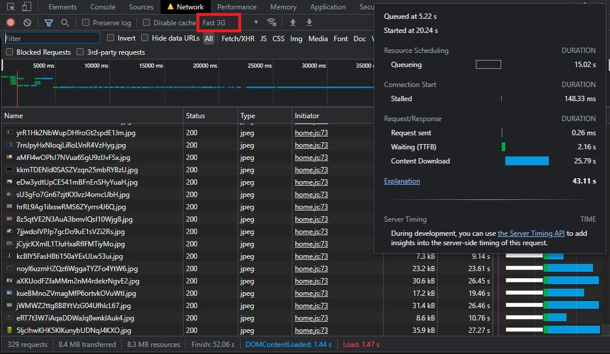
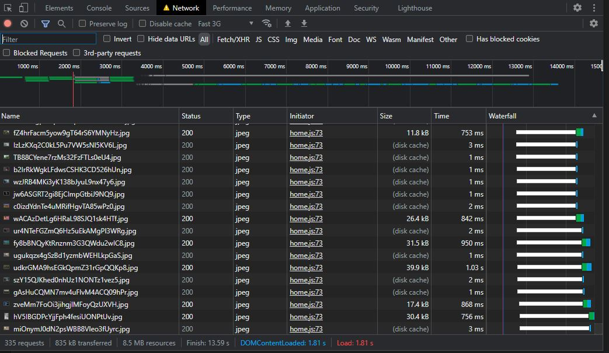
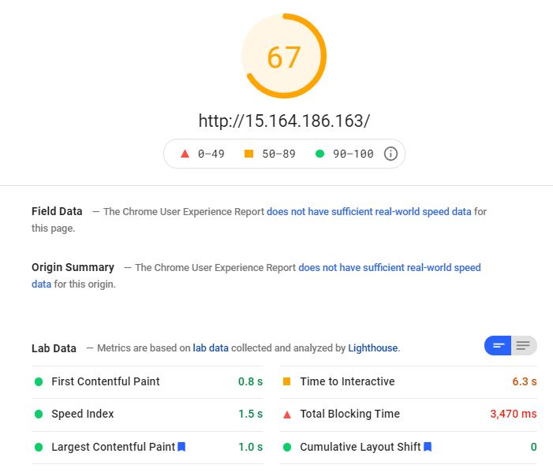
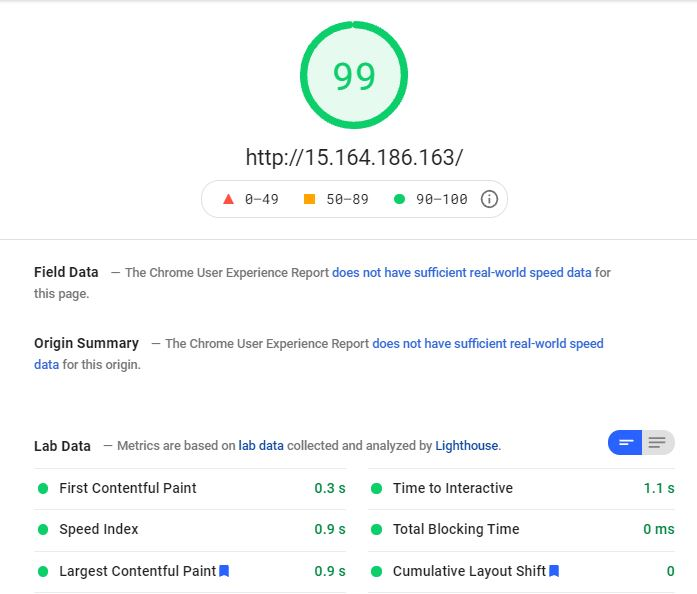

# Neo's Web optimization

http://15.164.186.163

## Before

- First load(Empty cache, Fast 3G)


- Second load(Fast 3G)


- Google PageSpeed(Mobile)


- Google PageSpeed(Desktop)


## Topic

- meta tag  
    추가
    ```html
    <meta name="application-name" content="Neo's Netflix">
    <meta name="author" content="Neo">
    <meta name="description" content="Neo's web optimization">
    <meta name="keywords" content="Neo, Web, optimization">
    ```
- 지연 로딩  
    변경(home.js)
    ```html
    
    ```
    ```javascript
    function loadReal(img) {
        if (img.display != "none") {
                        img.onload = null;
                        img.src = img.getAttribute("data-src");
        }
    }
    ```

## After

- First load(Empty cache, Fast 3G)

Requests: 330 -> 329  
Transferred: 8.4 MB -> 8.4 MB  
resources: 8.4 MB ->  8.3 MB   
Finish: 51.40s -> 52.06 s    
DOMContentLoaded: 1.36s -> 1.44 s    
Load: 1.41s -> 1.47 s   
  
  

- Second load(Fast 3G)

Requests: 323 -> 335   
Transferred: 99.1 kB -> 835 kB  
resources: 7.9 MB ->  8.5 MB  
Finish: 3.17s -> 13.59 s   
DOMContentLoaded: 1.20s -> 1.81 s   
Load: 1.20s -> 1.81 s  


- Google PageSpeed(Mobile)

Score: 71 -> 67    
First Contentful Paint: 0.8 s -> 0.8 s    
Speed Index: 1.5 s -> 1.5 s   
Largest Contentful Paint: 1.2 s -> 1.0 s  
Time to Interactive: 4.1 s -> 6.3 s     
Total Blocking Time: 1,970 ms -> 3,470 ms    
Cumulative Layout Shift: 0 -> 0   

- Google PageSpeed(Desktop)

Score: 92 -> 99    
First Contentful Paint: 0.3 s -> 0.3 s    
Speed Index: 0.7 s -> 0.9 s   
Largest Contentful Paint: 1.1 s -> 0.9 s  
Time to Interactive: 1.5 s -> 1.1 s     
Total Blocking Time: 200 ms -> 0 ms    
Cumulative Layout Shift: 0 -> 0   