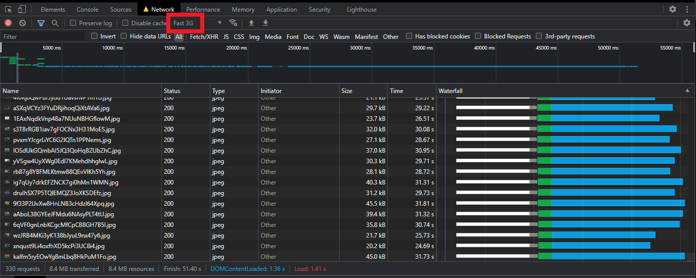
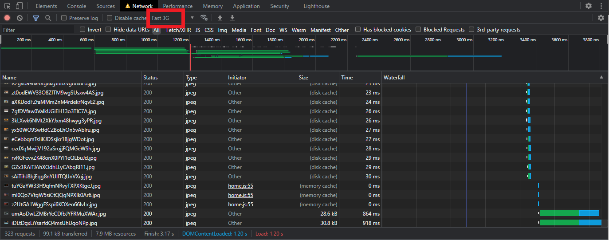
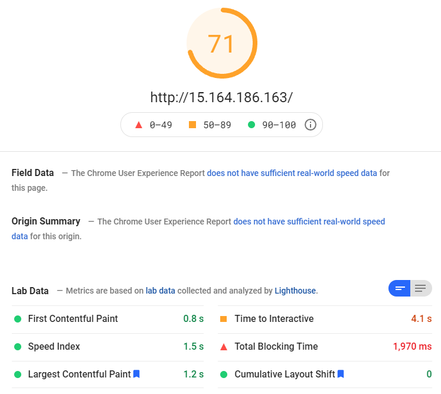
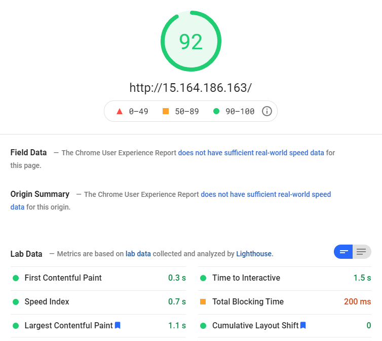

# Neo's Web optimization

http://15.164.186.163

## Before

- First load(Empty cache, Fast 3G)



- Second load(Fast 3G)



- Google PageSpeed(Mobile)



- Google PageSpeed(Desktop)



## Topic

- meta tag  
    추가
    ```html
    <meta name="application-name" content="Neo's Netflix">
    <meta name="author" content="Neo">
    <meta name="description" content="Neo's web optimization">
    <meta name="keywords" content="Neo, Web, optimization">
    ```
- 지연 로딩